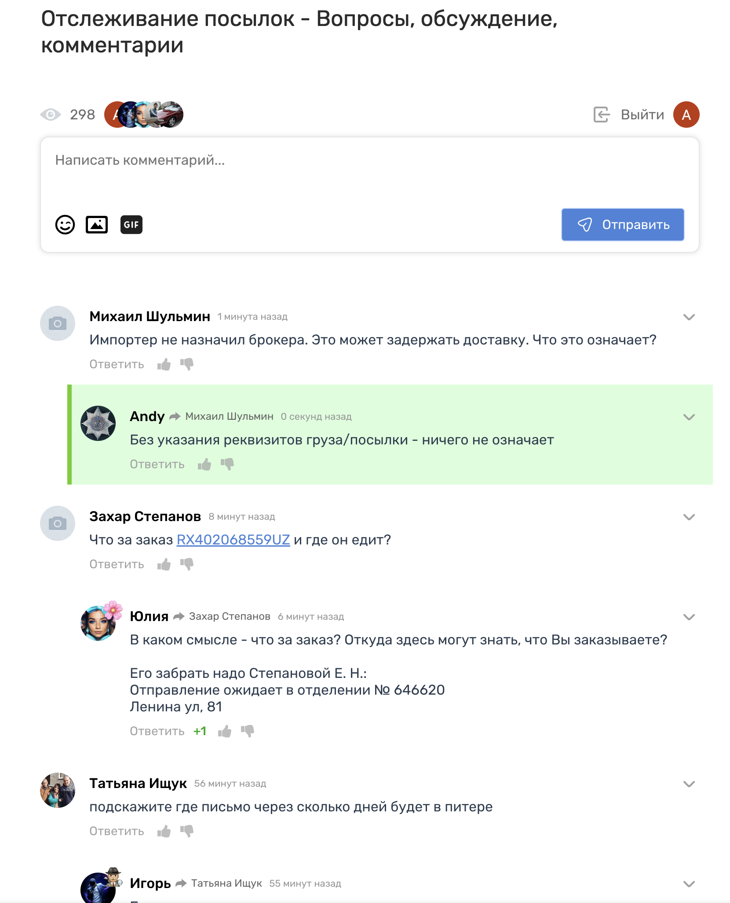

# Comments

Functional:
- [x] Hierarchical comments
- [x] Attachments (images, gifs via api)
- [x] Edit/delete comment by author or moderator
- [x] Reply to comment
- [x] Like/dislike comments
- [x] Auth with google/vk
- [x] Realtime update comments
- [ ] Tests

Stack: `go, centrifugo, postgresql, vuejs`

Example: 



# Run 

```bash
docker-compose up
```

# Use
Open demo page http://localhost:7777/demo 

